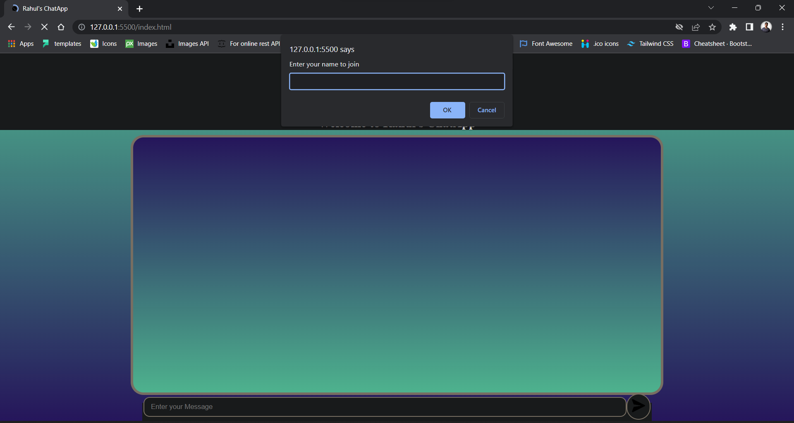
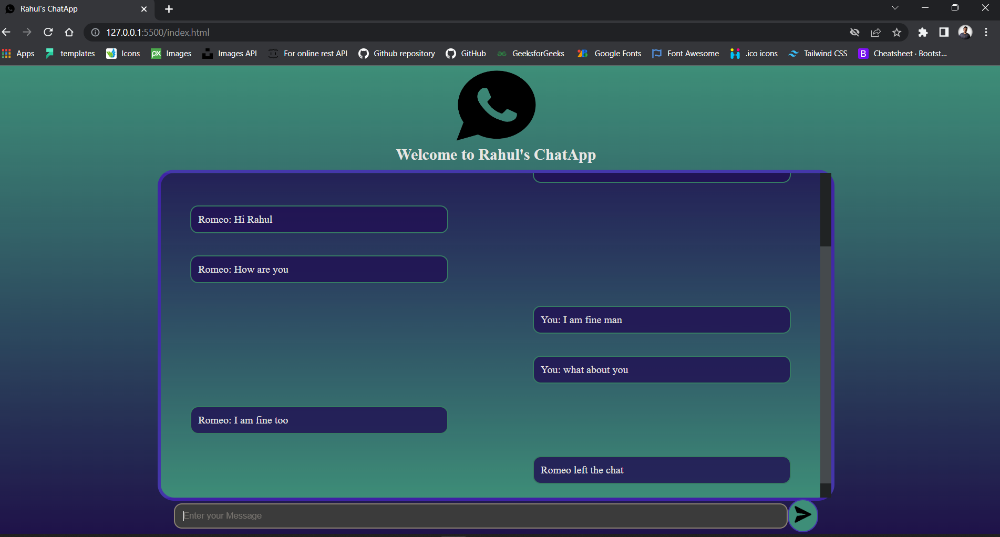
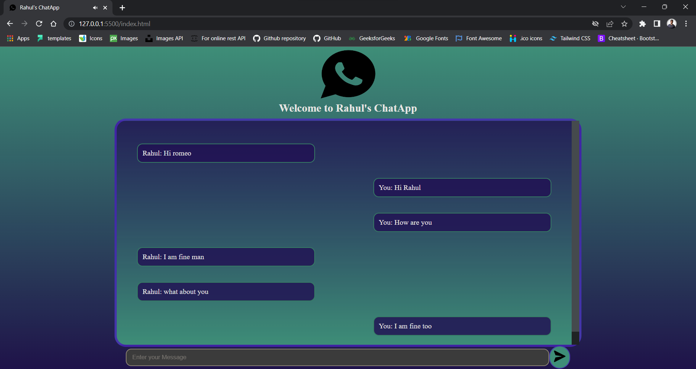

# Rahul-s-ChatApp
I created a realtime chat application using Node.Js and Socket.io

You can host this website and Chat with your friends. Hope you like it.

<h1>Some screen Shots of the App</h1>

