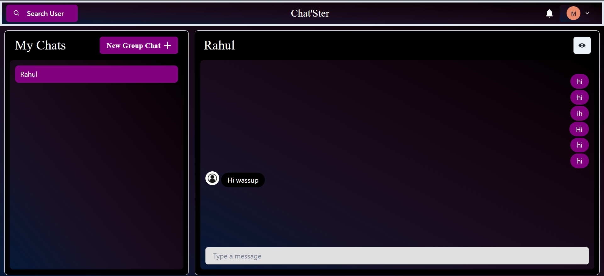

## A `MERN Stack` Chat Application create using `Socket.io` and `Chakra UI`

### Features Added till now

1. Login/Signup
2. Search For user
3. Create group chats
4. Realtime Chatting
5. Add or remove users from the group
6. User can change their details like name and profile pic

### Guide to set it up locally

#### Installing Dependencies

1. Open terminal in root folder and run `npm install` to install the dependencies

2. Now navigate to frontend folder using `cd .\frontend\` and run `npm install` to install frontend dependencies

#### Starting the server

1. Open terminal in root folder and run `npm start`

2. Open another terminal in frontend folder and run `npm run start`

3. Application will be opened in your browser now 💻

**Always add environment variables in root folder**

### Working of Chat'Ster

## Author's Social Links 🖥️

- [Twitter](https://twitter.com/rahu__24)
- [LinkedIn](https://www.linkedin.com/in/rahu24/)
- [Instagram](https://www.instagram.com/rahu__24/)